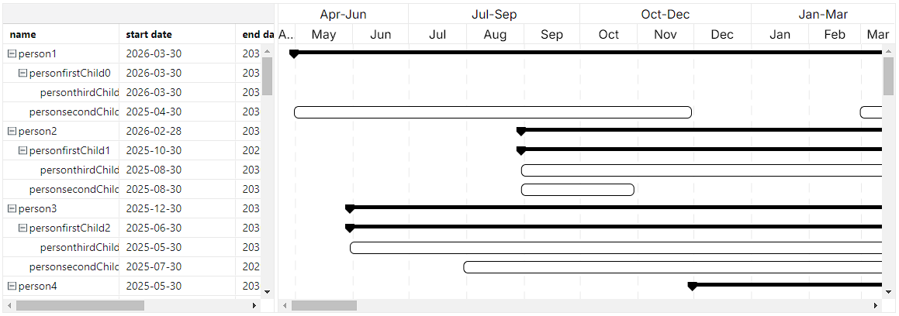

# vue-gantt-3 [](https://www.npmjs.com/package/vue-gantt-3) [](https://www.npmjs.com/package/vue-gantt-3) [](http://www.opensource.org/licenses/mit-license.php)

**English** | [中文](./README-CN.md)

A Gantt component for vue3. High performance(global virtual scroll), support time line move and stretch, change the time scale arbitrarily etc. The table part of the component bases on [ag-grid](https://github.com/ag-grid/ag-grid).

<div align="center">
  
</div>

## Install

```
npm install vue-gantt-3
```
or

```
yarn add vue-gantt-3
```
or

```
pnpm install vue-gantt-3
```

## Usage

Write the following in main.js:

```javascript
import { createApp } from 'vue';
import App from './App.vue';
import Vue3Gantt from 'vue-gantt-3';

const app = createApp(App);
app.use(Vue3Gantt);
app.mount('#app');
```

Example for App.vue:

```javascript
<template>
  <Vue3Gantt
      :getRowId="getRowId"
      :columns="columns"
      :rows="rows"
    ></Vue3Gantt>
</template>

<script lang="ts" setup>
  const getRowId = (rowData) => rowData.id;
  const columns = ref([
  {
    field: 'name',
    headerName: 'name',
    resizable: true,
    cellRendererParams: { expandable: true },
  },
  {
    field: 'displayStartDate',
    headerName: 'Start Date',
    resizable: true,
  },
  {
    field: 'displayEndDate',
    headerName: 'End Date',
    resizable: true,
  }
]);
const rows = shallowRef([
  {
    name: 'person 01',
    displayStartDate: '2025-01-01',
    displayEndDate: '2025-05-01',
    timeLines: {
      startDate: '2025-01-01',
      endDate: '2025-05-01'
    }
  },
  {
    name: 'person 02',
    displayStartDate: '2025-03-01',
    displayEndDate: '2025-08-01',
    timeLines: {
      startDate: '2025-03-01',
      endDate: '2025-08-01'
    }
  },
  {
    name: 'person 03',
    displayStartDate: '2025-05-01',
    displayEndDate: '2025-12-01',
    timeLines: {
      startDate: '2025-05-01',
      endDate: '2025-12-01'
    }
  }
]);
</script>
```

## License

This project is licensed under the MIT License - see the [LICENSE.md](LICENSE) file for details
